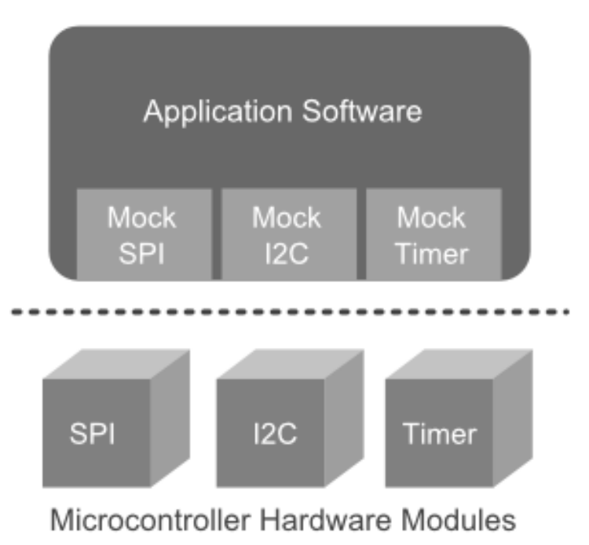

<center>
    <h1><b> Ceedling Unit Tests </b></h1>
</center>

## <b>Description</b>
Here's another ceedling TDD repo in this one i do things a bit differently to the previous TDD approach(writing tests for an already existing application) which turned out to be really difficult. So on this project ill be using the following tdd cycle:

### Cycle
1. Write a test, and watch it fail.
2. Implement just enough code to make the test pass.
3. Refactor.
4. Repeat.
## <b>Prerequisites</b>
- [Ceedling](http://www.throwtheswitch.org/ceedling)

## <b>Creating a new ceedling project</b>
Use the `ceedling new <projectName>` command to create a new project:
```bash
$ ceedling new rethink
```
This generates:
- `src` : Where all of the source files will go.
- `build` :  Contains anything generated by Ceedling during the build.
- `test` : Where our unit test files will go.

## <b>Creating a module</b>
```bash
$ ceedling module:create[lights]
File src/lights.c created
File src/lights.h created
File test/test_lights.c created
Generate Complete
```
This creates three files: lights.c to implement our module, lights.h to define the public APIs and a test file where unit tests for the module are created.

## <b>Run unit tests</b>

```bash
$ ceedling test:all


Test 'test_lights.c'
--------------------
Generating runner for test_lights.c...
Compiling test_lights_runner.c...
Compiling test_lights.c...
Compiling unity.c...
Compiling lights.c...
Compiling cmock.c...
Linking test_lights.out...
Running test_lights.out...

--------------------
IGNORED TEST SUMMARY
--------------------
[test_lights.c]
  Test: test_lights_NeedToImplement
  At line (17): "Need to Implement lights"

--------------------
OVERALL TEST SUMMARY
--------------------
TESTED:  1
PASSED:  0
FAILED:  0
IGNORED: 1
```

## Implement a test
In the testdriven way, we'll first add a test that describes some desired behavior. Say we want this
behavior:
`When the headlight switch is off, then the headlights are off`
The test function:
```c
void test_WhenTheHeadlightSwitchIsOff_ThenTheHeadLightsAreOff(void)
{
 // Switch off headlight
 lights_SetHeadlightSwitchOff();
 // Confirm the state of the headlights
 TEST_ASSERT_EQUAL(false, lights_AreHeadlightsOn());
}
```
## Implement the functionality
`lights.h`:
```bash
#ifndef lights_H
#define lights_H
#include <stdbool.h>
void lights_SetHeadlightSwitchOff(void);
bool lights_AreHeadlightsOn(void);
#endif // lights_H
```
`light.c` :
```bash
#include "lights.h"
#include <stdbool.h>
void lights_SetHeadlightSwitchOff(void)
{
}
bool lights_AreHeadlightsOn(void)
{
 return false;
}
```
Running the tests again:
```bash
$ ceedling test:all


Test 'test_lights.c'
--------------------
Running test_lights.out...

--------------------
OVERALL TEST SUMMARY
--------------------
TESTED:  1
PASSED:  1
FAILED:  0
IGNORED: 0
```

## Repeat
Add more tests and then write the code to make them pass

```bash
$ ceedling test:all


Test 'test_lights.c'
--------------------
Generating runner for test_lights.c...
Compiling test_lights_runner.c...
Compiling test_lights.c...
Compiling unity.c...
Compiling lights.c...
Compiling cmock.c...
Linking test_lights.out...
Running test_lights.out...

--------------------
OVERALL TEST SUMMARY
--------------------
TESTED:  2
PASSED:  2
FAILED:  0
IGNORED: 0
```

## <b>Mocking Hardware interfaces</b>
To unit test embedded software without hardware dependencies requires `mocking`.In most cases when one is developing software for an embedded microcontroller, you are probably going to
be using the microcontroller-provided hardware modules for things like SPI, I2C, timers, etc.
<p align="center">
</img>
</p>

For each of these hardware interfaces, we want to have a corresponding software module
containing the microcontroller hardware dependencies (i.e. hardware register accesses).
<p align="center">
</img>
</p>
One can then mock each of these hardware interfaces, eliminating hardware dependencies
but still allowing one to unit test their application. Instead of compiling these tests for the
embedded microcontroller, we compile them for and run them on the host PC.
<p align="center">
</img>
</p>

The mocking framework in ceedling is `CMock` and it allows one to create mocks of individual
software modules from their header files.

## <b>Mocking an i2c(temperature sensor) interface with Cmock</b>
### Create the temp sensor module
```bash
$ ceedling module:create[tempSensor]
```
#### Fictional Datasheet of the temp sensor
The temperature sensor has a bunch of 16-bit registers -- each with 8-bit addresses -- one of which is the temperature register. The scaling of the values is such that a register value of 0 is -100.0°C and a register value of 0x3FF is +104.6°C. This makes each bit equivalent to 0.2°C.

| Register Value | Temperature |
|----------------|-------------|
| 0x000          | -100.0°C    |
| 0x1F4          | 0.0°C       |
| 0x3FF          | +104.6°C    |

### Write first test
#### `Feature to implement`: Read the current temperature value
#### `Test` : Reading temperature register value of 0x3FF gives a temperature of 104.6°C.
```c
void test_whenTempRegisterReadsMaxValue_thenTheTempIsTheMaxValue(void)
{
  uint8_t tempRegisterAddress = 0x03;
  float expectedTemperature = 104.6f;
  float tolerance = 0.1f;
  //When
  i2c_readRegister_ExpectAndReturn(tempRegisterAddress, 0x3ff);
  //Then
  float actualTemperature = tempSensor_getTemperature();
  TEST_ASSERT_FLOAT_WITHIN(tolerance, expectedTemperature,actualTemperature);
}
```
The goal is to simulate (or mock) the I2C module returning a value of 0x3ff on a read of the
temperature address.At the moment, we assume that there is another i2c module (it doesn't actually exist yet) that handles the I2C communication with the temperature sensor. This is where the hardware dependent code will eventually go.
The `i2c_readReadgister_ExpectAndReturn` function is actually a mock function used to simulate a call to a function called `i2c_readRegister` in the i2c module. 
We then test that the tempSensor module actually returns the correct temperature when we call `tempSensor_getTemperature` . This function doesn't exist yet either.

### Create the function(`tempSensor_getTemperature`) under test(dummy implementation)
`tempSensor.h`:
```c
#ifndef tempSensor_H
#define tempSensor_H
float tempSensor_getTemperature(void);
#endif // tempSensor_H
```
`tempSensor.c`:
```c
#include "tempSensor.h"
float tempSensor_getTemperature(void)
{
  return 0.0f;
}
```
### Mock the i2c interface
One doesn't actually need to implement this function. It's enough to declare the
function prototype in a header file and tell Ceedling to mock it with CMock.
`i2c.h`:
```c
#ifndef i2c_H
#define i2c_H
#include <stdint.h>
uint16_t i2c_readRegister(uint8_t registerAddress);
# endif // i2c_H
```
To get ceedling to mock this module one has to add this line to `test_tempSensor.c`:
```c
#include "mock_i2c.h"
```
When CMock gets a hold of the header file it looks at all the functions defined there and
generates several mock functions for each... including the `i2c_readRegister_ExpectAndReturn` function we used in the test. This mock function appends an additional argument to the original `i2c_readRegister` function, which is the value we want the function to return to the calling function.

Running the test at this point:
```bash
ceedling test:tempSensor


Test 'test_tempSensor.c'
------------------------
Compiling tempSensor.c...
Linking test_tempSensor.out...
Running test_tempSensor.out...

-------------------
FAILED TEST SUMMARY
-------------------
[test_tempSensor.c]
  Test: test_whenTempRegisterReadsMaxValue_thenTheTempIsTheMaxValue
  At line (26): "Expected 104.6 Was 0"

--------------------
OVERALL TEST SUMMARY
--------------------
TESTED:  1
PASSED:  0
FAILED:  1
IGNORED: 0

---------------------
BUILD FAILURE SUMMARY
---------------------
Unit test failures.
```
This is because our dummy implementation of the function `tempSensor_getTemperature` returns 0

### Implement the logic of the function(`tempSensor_getTemperature`)
```c
#include <stdint.h>
#include <stdio.h>
#include "tempSensor.h"
#include "i2c.h"
float tempSensor_getTemperature(void)
{
    uint16_t rawValue = i2c_readRegister(0x03);
    float currentTemperature = -100.0f + (0.2f * (float)rawValue);
    printf("rawvalue:%d temperature:%f", rawValue, currentTemperature);
    return currentTemperature;
}
```
If we run our test now:
```bash
$ ceedling test:tempSensor


Test 'test_tempSensor.c'
------------------------
Compiling tempSensor.c...
Linking test_tempSensor.out...
Running test_tempSensor.out...

-----------
TEST OUTPUT
-----------
[test_tempSensor.c]
  - "rawvalue:1023 temperature:104.600006"

--------------------
OVERALL TEST SUMMARY
--------------------
TESTED:  1
PASSED:  1
FAILED:  0
IGNORED: 0
```
## Repeat
Add more tests for other possible return values from i2c_readRegister.This is easily done by changing the return value provided to the mock function.
```bash
$ ceedling test:tempSensor


Test 'test_tempSensor.c'
------------------------
Running test_tempSensor.out...

-----------
TEST OUTPUT
-----------
[test_tempSensor.c]
  - "rawvalue:1023 temperature:104.600006"
  - "rawvalue:0 temperature:-100.000000"

--------------------
OVERALL TEST SUMMARY
--------------------
TESTED:  2
PASSED:  2
FAILED:  0
IGNORED: 0
```
Now we have a driver for an external hardware device that we can test without any of
the hardware.

## Acknowledgment
Special thanks to 
- [ThrowTheSwitch.org community](http://www.throwtheswitch.org/) 
- [These awesome articles](http://www.electronvector.com/)

## <b>License</b>
[](LICENSE)
